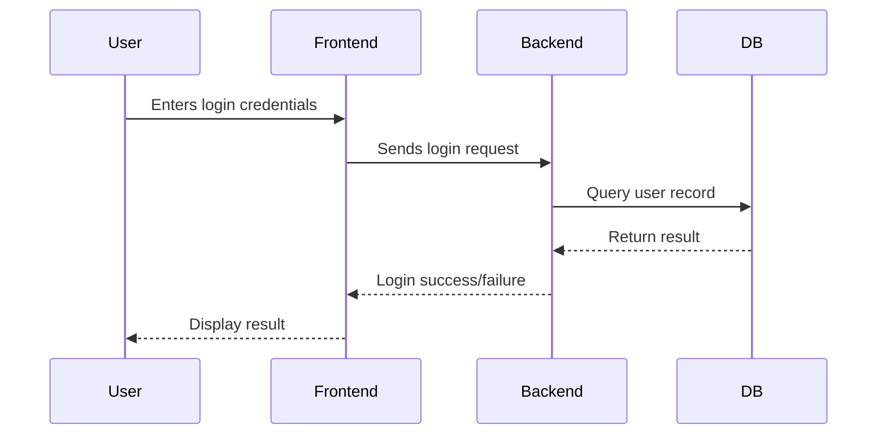

---

```markdown
# Developer Documentation Training Capstone

Welcome to the capstone project for the **Developer Documentation Training** program. This project demonstrates a complete and professional documentation workflow, including clear Markdown writing, architectural diagrams, system design documentation, and a published site using MkDocs with the Material theme.

---

## 🚀 Project Purpose

This project showcases:
- Writing developer-friendly documentation using **Markdown**
- Creating and embedding **Mermaid** and **Draw.io** diagrams
- Structuring documentation using **MkDocs + Material**
- Writing clear **design documents** and **architecture overviews**
- Versioning docs alongside code in a monorepo structure

---


```

````

---

## ⚙️ Installation & Setup

### 1. Install MkDocs & Material Theme

```bash
pip install mkdocs mkdocs-material
````

### 2. Clone the Repository

```bash
git clone https://github.com/yourusername/dev-docs-capstone.git
cd dev-docs-capstone
```

### 3. Start Local Server

```bash
mkdocs serve
```

Visit `http://127.0.0.1:8000/
` in your browser to preview the documentation site.

---

## 📚 Documentation Highlights

### 🔷 Mermaid Sequence Diagram




---

### 🔶 System Block Diagram

An architectural overview of a simple 3-tier application is provided as a PNG image exported from Draw\.io:


link: https://drive.google.com/file/d/1XiaENbstznEW7S5aVOXktsM4LATVyya1/view?usp=sharing

---

### 📝 Design Document

Read the complete design doc [here](docs/design.md). It outlines:

* Problem statement
* Goals and non-goals
* Design options considered
* Final decision and rationale
* Potential risks and mitigations
link: http://127.0.0.1:8000/

---

### 🧭 Architecture Documentation

See [architecture.md](docs/architecture.md) for a system-wide view of components, data flow, and constraints. Helps new developers understand the system quickly.

---

## 🔗 Published Site

Browse the full documentation site here:

👉 [**View MkDocs Site**](https://github.com/shravyamiri/publish)
*(Replace with actual link after publishing)*

### Xmind
link : https://xmind.ai/share/SwLgmaQA?xid=Sp21tzWS
---

## 🗓 Daily Learning Log

The [`daily-log.md`](docs/daily-log.md) file captures daily reflections including:

* What I learned
* What confused me
* Questions I still have

This log helps measure growth and promote clarity over time.

---

## ✅ Exit Criteria Checklist

* [x] Professional `README.md`
* [x] Mermaid.js sequence diagram
* [x] Draw\.io block diagram
* [x] Design doc in Markdown
* [x] Architecture overview
* [x] Daily learning log
* [x] MkDocs setup with Material theme
* [x] Published and browsable documentation site

---

## 🧠 Best Practices Followed

* Version-controlled docs in the monorepo
* Documentation created before, during, and after development
* Diagrams + text used for better understanding
* Markdown used as primary documentation format
* Clear naming and structure

---

## 🙌 Contribution

This capstone is intended for individual learning, but feel free to fork and improve. PRs for enhancements, bug fixes, or new diagrams are welcome.

---

## 📄 License

MIT License – See [LICENSE](LICENSE) for details.

```

---


```
