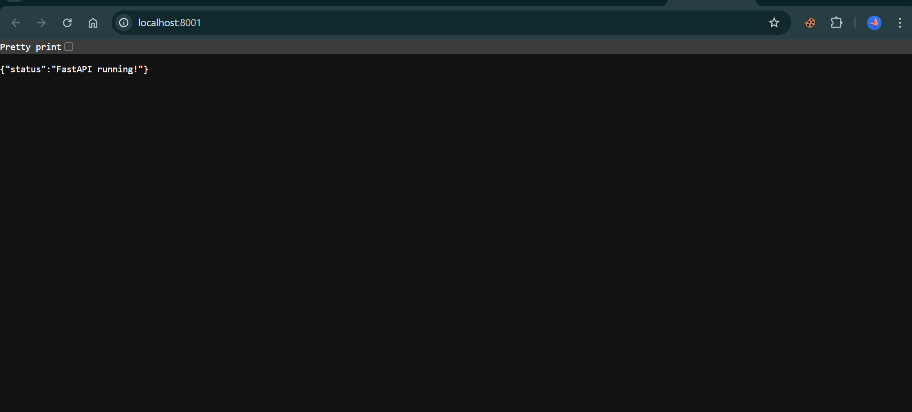
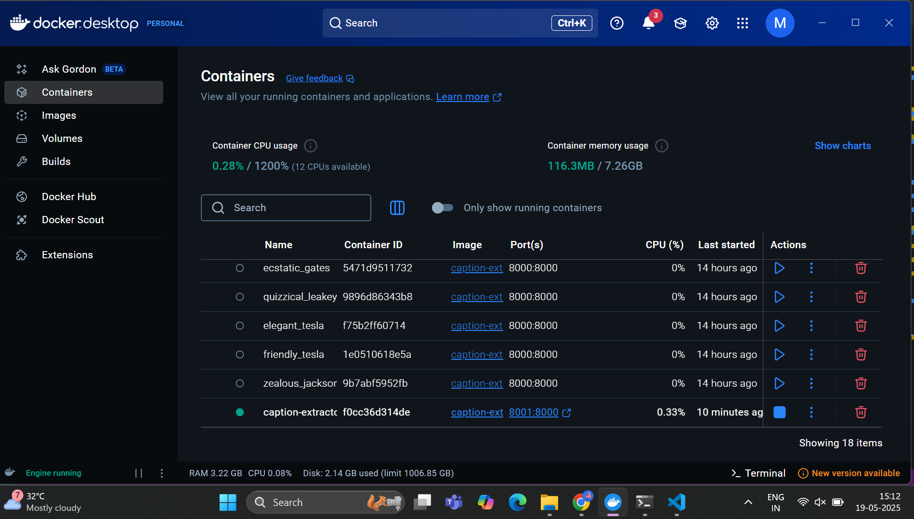
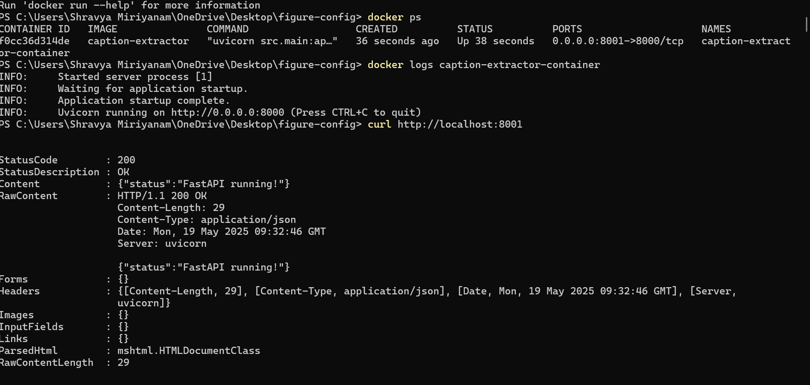
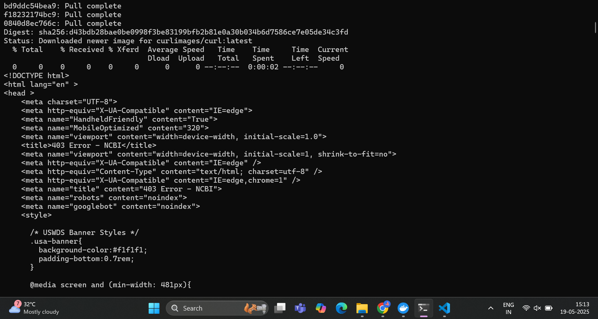
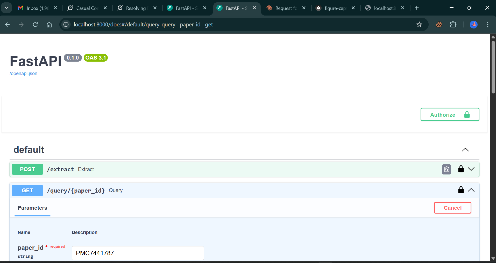
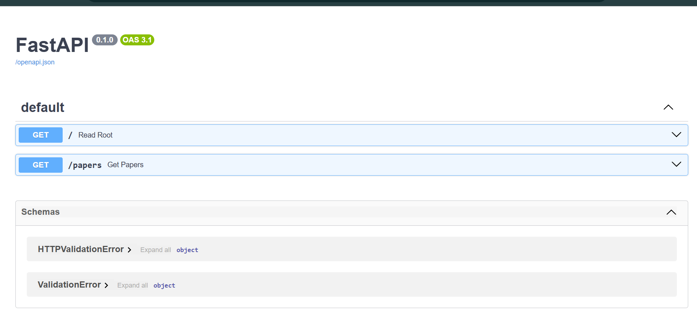
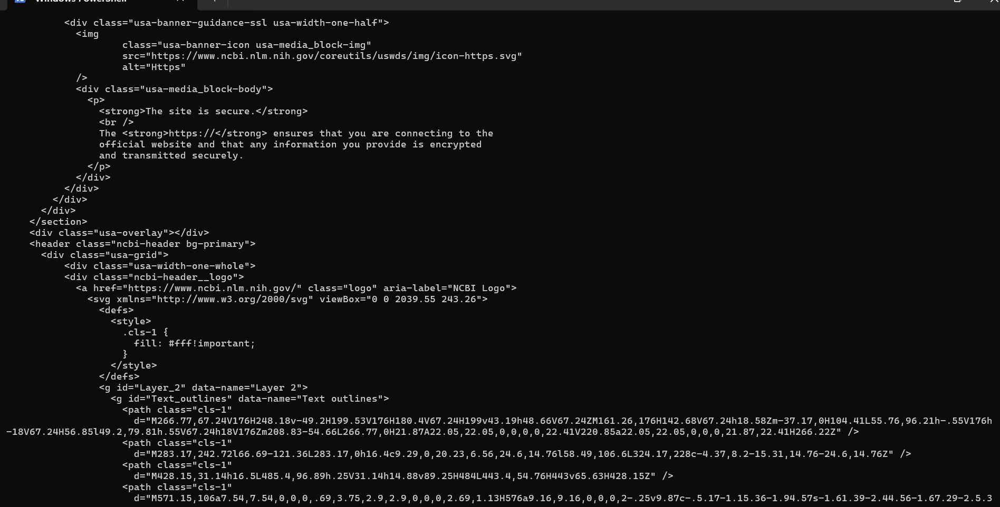

Figure Caption Extraction System
A system to extract and store figure captions and metadata from scientific publications using PubMed Central and PubTator3 APIs.
Setup

Install Docker.
Clone this repository.
Create data and input directories:mkdir data input

Generate an NCBI API key:
Sign in to https://www.ncbi.nlm.nih.gov/ using a third-party login (e.g., Google).
Click your username, go to "API Key Management", and click "Create an API Key".
Copy the key and update config.yaml with it under data_source.api_key.

Update config.yaml with your NCBI API key and a secure API key for the system (api.key).

Build and Run
make build
make run

Usage
CLI
Ingest papers:
python -m src.cli ingest --pmcids PMC7096749

Query papers (JSON output):
python -m src.cli query --pmcids PMC7096749 --format json

Query papers (CSV output):
python -m src.cli query --pmcids PMC7096749 --format csv

API
Ingest papers:
curl -X POST "http://localhost:8000/ingest" -H "X-API-Key: your-api-key" -H "Content-Type: application/json" -d '{"pmcids": ["PMC7096749"]}'

Query papers (JSON):
curl "http://localhost:8000/papers?pmcids=PMC7096749" -H "X-API-Key: your-api-key"

Query papers (CSV):
curl "http://localhost:8000/papers?pmcids=PMC7096749&format=csv" -H "X-API-Key: your-api-key"

Upload file:
curl -X POST "http://localhost:8000/upload" -H "X-API-Key: your-api-key" -F "file=@pmcids.txt"

Watched Folder
Start the watcher:
python -m src.watcher config.yaml

Place a file with PMCIDs in the input directory.
Output

JSON: Query results are returned in JSON format by default.
CSV: Ingested papers are stored in data/output.csv and can be queried in CSV format.

docker

some images of cmd

some images of fastapi

command to execute in fastapi
try {
    $response = Invoke-WebRequest -Method POST -Uri http://localhost:8001/extract -Headers @{
        "X-API-Key" = "beafaa69c8ca82900b029902b54c78e8a108"
        "Content-Type" = "application/json"
    } -Body '["PMC7441787", "PMC7146658"]' -ErrorAction Stop
    $response.Content | ConvertFrom-Json | ConvertTo-Json -Depth 10
}
catch {
    Write-Error "Error: $($_.Exception.Message)"
}

output

[
    {
        "id": "PMC7441787",
        "source_type": "PMC",
        "title": "Sample Paper Title on Genetic Analysis",
        "abstract": "This paper explores genetic mutations in XYZ...",
        "captions": [
            {
                "figure_id": "fig1",
                "caption": "Figure 1: Expression levels of BRCA1 in cancer cells.",
                "url": "https://www.ncbi.nlm.nih.gov/pmc/articles/PMC7441787/figure/fig1"
            },
            {
                "figure_id": "fig2",
                "caption": "Figure 2: Protein interaction network involving TP53.",
                "url": "https://www.ncbi.nlm.nih.gov/pmc/articles/PMC7441787/figure/fig2"
            }
        ],
        "entities": [
            {
                "figure_id": "",
                "entity_type": "Gene",
                "entity_text": "BRCA1"
            },
            {
                "figure_id": "",
                "entity_type": "Gene",
                "entity_text": "TP53"
            }
        ]
    },
    {
        "id": "PMC7146658",
        "source_type": "PMC",
        "title": "Another Sample Paper on Protein Studies",
        "abstract": "This study investigates protein interactions...",
        "captions": [
            {
                "figure_id": "fig1",
                "caption": "Figure 1: Structure of AKT1 protein.",
                "url": "https://www.ncbi.nlm.nih.gov/pmc/articles/PMC7146658/figure/fig1"
            }
        ],
        "entities": [
            {
                "figure_id": "",
                "entity_type": "Protein",
                "entity_text": "AKT1"
            }
        ]
    }
]

output in cmd

